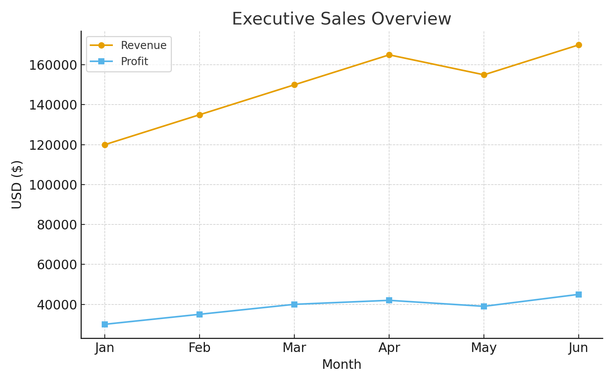

# PowerBI-AdventureWorks  

[](https://powerbi.microsoft.com)  
[](https://github.com/azeezyusufPBID/PowerBI-AdventureWorks/commits/main)  
[](https://github.com/azeezyusufPBID/PowerBI-AdventureWorks/issues)  
[](https://github.com/azeezyusufPBID/PowerBI-AdventureWorks/stargazers)  
[](LICENSE)  

**Enterprise-Grade Power BI Project Repository** — aligned with **Developer Specialist** and **Architect** learning tracks.  
This repository demonstrates *industry-recognized BI practices and architectures*, showcasing real-world BI solutions, version control best practices, and enterprise data modeling.  

---

## Table of Contents
- [Project Structure](#project-structure)
- [Quick Links](#quick-links)
- [Getting Started](#getting-started)
- [Professional Projects](#professional-projects)
- [Tech Stack](#tech-stack)
- [Workflow](#workflow)
- [Best Practices](#best-practices)
- [Sample Dashboards](#sample-dashboards)
- [Roadmap](#roadmap)
- [Contribution](#contribution)
- [License](#license)

---

**Quick Links:**  
[PowerBIReports](./PowerBIReports/) • [Docs](./Docs/) • [Issues](../../issues) • [Commits](../../commits)  

---

## Getting Started

1. Open the `.pbip` project in Power BI Desktop.  
2. Update the data source connection string (e.g., SQL Server or sample DB).  
3. Click **Refresh** to load the AdventureWorks data.  
4. Explore dashboards: Sales, Customer, Product, and Geography views.  

> This 1-2-3 process ensures anyone (including recruiters) can test the project locally.

---

## Project Structure
```plaintext
/PowerBIReports/   → Report layouts & semantic models (.pbip)
/SQLScripts/       → SQL scripts & queries
/DAX/              → Measures, KPIs, calculations
/Docs/             → Project documentation, ERDs, playbooks, dashboards
.gitignore
README.md
LICENSE
```

---

## Professional Projects  

### Project 1: CFO Executive Finance Pack  
- Revenue, Gross Margin, Opex, Cash Flow  
- MoM, YoY, YTD, Forecast vs Actuals  
- Dynamic RLS by Legal Entity & Cost Center  
- Deliverables: PBIP, ERD, RLS Playbook, Performance Notes  

### Project 2: Retail/CPG OTIF & Inventory  
- KPIs: OTIF, Stockouts, Lead Time  
- Hybrid Model (DirectQuery + Aggregations)  
- RLS for Vendor Partners  
- Deliverables: PBIP, DAX Library, RLS Docs  

### Project 3: SaaS Revenue & NRR Pack (Architect Track)  
- ARR, MRR, NRR, Cohort Retention  
- Golden Dataset Strategy  
- CI/CD with GitHub Actions & REST API  
- Deliverables: Semantic Model, CI/CD YAML, Governance Runbook  

Deliverables: [PBIP](./PowerBIReports/) • [ERD](./Docs/) • [RLS Playbook](./Docs/)

---

## Tech Stack  
- **Power BI Desktop** (with `.pbip` project mode)  
- **SQL Server / Azure Synapse / Fabric Lakehouse**  
- **DAX** for advanced time intelligence  
- **Power Query (M)** for transformations  
- **PowerShell & REST API** for automation  
- **GitHub (CI/CD pipelines)** for version control  

---

## Workflow  

1. **Develop Locally** in Power BI Desktop (`.pbip` mode).  
2. **Commit & Push** changes with Git.  
3. **Branch Strategy**:  
   - `main` → production-ready  
   - `dev` → development  
   - `feature/*` → feature-specific dashboards/metrics  
4. **Deploy & Automate** with Power BI Deployment Pipelines or GitHub Actions.  

---

## Best Practices  
✔ Keep `.pbix` files out of Git (too large, binary).  
✔ Track .pbip, .json, and .tmdl files for collaborative version control.”  
✔ Use **Golden Datasets** for enterprise scalability.  
✔ Implement **RLS/OLS** for data security.  
✔ Apply **CI/CD pipelines** for consistency across Dev → Test → Prod.  

---

## Sample Dashboards  

### Executive Sales Overview  
  

### Customer Insights  
  

### Product Performance  
  

### Geographic Sales Performance  
  

---

## Roadmap

- Add Power BI Deployment Pipeline examples  
- Integrate Azure Synapse use case  
- Automate dataset refresh with PowerShell/REST API 

Roadmap is aspirational and may evolve as feature implementations progress.

---

## Contribution  
Pull requests are welcome! ⭐ Star this repo if you find it helpful.  

---

## License  
This project is licensed under the [MIT License](LICENSE).  
